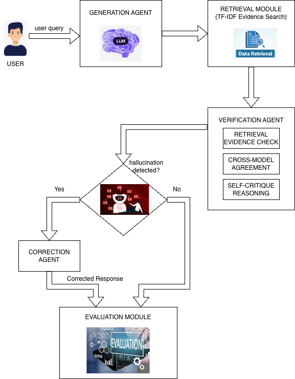
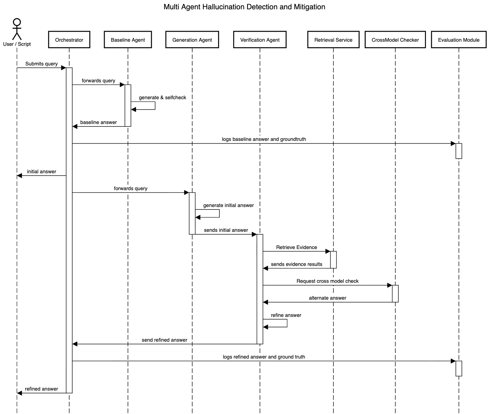

# Multi-Agent Hallucination Detection and Correction System


This repository contains the implementation accompanying the MSc dissertation submitted to **Liverpool John Moores University (LJMU)**.

The project investigates methods for **detecting and correcting hallucinations in Large Language Model (LLM) outputs** using a modular multi-agent verification framework.

---
# Overview
Large Language Models often generate **hallucinated responses**, where statements appear plausible but are not supported by factual evidence.

This project proposes a **multi-agent hallucination detection and correction framework** that combines:
* retrieval-based evidence grounding
* similarity-based hallucination verification
* evidence-guided response correction
* modular experiment orchestration

The goal is to improve the **factual reliability of LLM-generated responses** using lightweight verification strategies.

---
# System Architecture



The framework follows a modular architecture where retrieval, verification, and correction components collaborate to identify and mitigate hallucinated responses.

---
# System Workflow



The workflow illustrates how the system processes responses through multiple stages including retrieval-based evidence grounding, verification, and correction.

---
# Datasets

The system is evaluated using two publicly available hallucination benchmarks:

* **MedHallu** – medical hallucination detection benchmark

* **TruthfulQA** – adversarial truthfulness evaluation dataset

Due to licensing and dataset size constraints, the raw datasets are **not included in this repository**.

Users must download the datasets separately and place them in:
```
data/raw/
```
---
# Project Structure
```
scripts/        Core pipeline scripts
data/
   raw/         Raw datasets (not included)
   processed/   Cleaned datasets used for experiments

indices/        TF-IDF retrieval index files (excluded from version control)

results/
   figures/     Generated plots used in the dissertation
   *.json       Experiment metrics
   *.csv        Summary results

docs/           Architecture and sequence diagrams

requirements.txt
README.md
```
---
# Experimental Pipeline

The system is implemented as a **multi-stage experimental pipeline**.

Stage 1 – Dataset preprocessing

Stage 2 – Retrieval index construction

Stage 3 – Hallucination verification

Stage 4 – Response correction

Stage 5 – Experiment orchestration

Stage 6 – Result visualization

Key scripts:
```
scripts/run_project.py
scripts/build_retrieval_index.py
scripts/stage3_verify.py
scripts/stage4_correct.py
scripts/stage5_run_experiments.py
scripts/stage6_plots.py
```
---
# Installation

Create a Python virtual environment and install dependencies.
```
python -m venv .venv
source .venv/bin/activate
pip install -r requirements.txt
```
The project was tested using **Python 3.10+**.

---
# Running the Pipeline

Example workflow:
### 1. Preprocess datasets

```
python scripts/run_project.py \
  --medhallu_path data/raw/medhallu_data.csv \
  --truthfulqa_path data/raw/TruthfulQA.csv
```
### 2. Build retrieval index

```
python scripts/build_retrieval_index.py
```
### 3. Run hallucination verification

```
# Threshold tuning (recommended)
python scripts/stage3_verify.py \
  --top_k 5 \
  --alpha 0.7 \
  --threshold_sweep 0.05,0.10,0.15,0.20,0.25,0.30,0.35,0.40,0.45,0.50,0.55 \
  --save_sweep_path results/stage3_sweep_metrics.json

# Final run (selected threshold)
python scripts/stage3_verify.py \
  --top_k 5 \
  --alpha 0.7 \
  --threshold 0.55
```
### 4. Run correction stage

```
python scripts/stage4_correct.py
```
### 5. Run experiment pipeline

```
python scripts/stage5_run_experiments.py --verify_threshold 0.55 --top_k 5 --alpha 0.7
```
### 6. Generate result plots

```
python scripts/stage6_plots.py
```
---
# Outputs

The pipeline produces several output files:
```
results/stage3_metrics.json
results/stage4_metrics.json
results/stage5_summary.csv
results/stage5_summary.json
results/stage5_outputs.jsonl
```
Visualization figures are generated in:

```
results/figures/
```
---
# Key Results

The proposed multi-agent verification and correction framework was evaluated on a unified binary dataset combining MedHallu and TruthfulQA.

Key findings:

* **High precision hallucination detection** (~0.97)
* **Strong recall performance** (~0.89)
* **F1-score of ~0.93**, indicating balanced detection capability
* Approximately **40% hallucination reduction** on the MedHallu dataset after applying correction
* **Low regression rate (~2%)**, indicating minimal degradation of correct responses

These results demonstrate that retrieval-grounded verification combined with evidence-guided correction can significantly improve the factual reliability of LLM-generated responses.

---
# Reproducibility

The dissertation implementation is frozen under:
```
Git tag: v1-ljmu-dissertation
```
This ensures that the exact code used for the dissertation experiments can be reproduced.

---
# Large Artifacts

Per-sample experiment logs are excluded from version control due to size constraints.
Summary metrics and figures required to reproduce the results are included.

---
# License
This project is released under the **MIT License**.

---
# Citation

If you use this work in research or academic projects, please cite the dissertation as:

```id="citation"
Ravikiran VK (2026).
Multi-Agent Hallucination Detection and Correction System.
MSc Artificial Intelligence & Machine Learning Dissertation,
Liverpool John Moores University.
```
---
# Author

**Ravikiran VK**
MSc Artificial Intelligence & Machine Learning
Liverpool John Moores University
